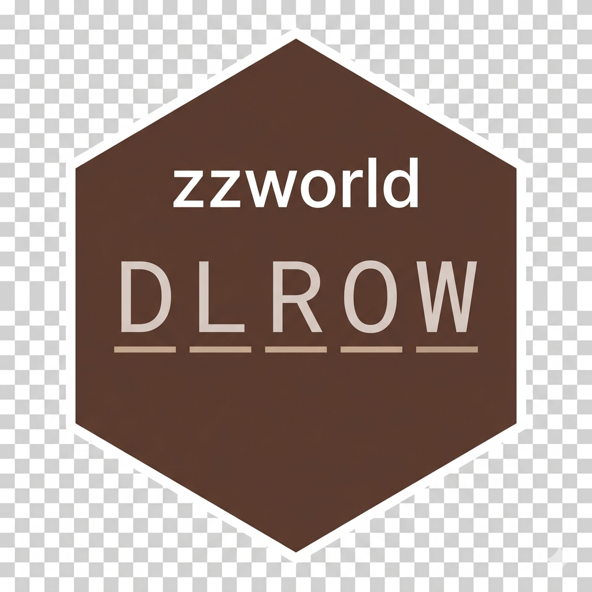

# zzworld <a href="https://github.com/rgt47/zzworld"></a>

WORLD Test Scoring and Edit Distance Analysis

## Overview

`zzworld` provides functions for analyzing WORLD test responses in cognitive
assessments. The WORLD test asks patients to spell "WORLD" backwards as part
of the Mini-Mental State Examination (MMSE).

## Features

- Edit distance calculation between responses and target "WORLD"
- Multiple scoring method comparisons
- MMSE calculation integration
- Report generation for edit distance analysis

## Installation

```r
devtools::install_github("rgt47/zzworld")
```

## Functions

Scoring rules. Folstein's 1975 instruction is ambiguous, so the
competing readings are provided side by side rather than one being
chosen:

- `score_position()` - positional correctness (Rule B)
- `score_lis()` - longest correctly ordered subsequence (Rule C,
  Beckett et al. / SMMSE line method)
- `score_examiner()` - sum of the examiner's per-position flags (Rule A)
- `dlr_scr()`, `dlr_scr_vec()` - Tancredi-Sellers-Ulam deduction score
- `score_world_backwards()`, `score_mundo_backwards()` - edit-distance
  score against `DLROW` / `ODNUM`

MMSE:

- `calc_mmse()` - full MMSE total and attention sub-score
- `calc_mmse_attention()` - attention sub-score alone
- `levenshtein_distance()` - edit distance between two strings

Comparison and reporting:

- `run_comparison_pipeline()`, `gen_comparison_report()`,
  `gen_diff_report()`, `gen_edit_distance_reports()`
- `gen_all_combinations()`, `get_discrepancies()`,
  `add_stringdist_comparison()`

## Usage

```r
library(zzworld)

# The same response under each scoring rule
score_position("DLORW")   # 3 - two letters out of position
score_lis("DLORW")        # 4 - one transposition
dlr_scr("DLORW")          # 4 - one Ulam deduction

# Edit distance and the MMSE attention sub-score
levenshtein_distance("DLROW", "DLORW")   # 2
score_world_backwards("dlorw")           # 3 - case is folded
```

## License

GPL-3

## Author

Ronald (Ryy) G. Thomas (rgthomas@ucsd.edu)
